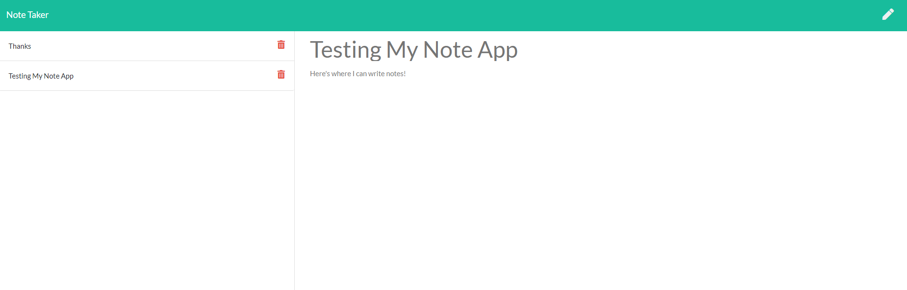
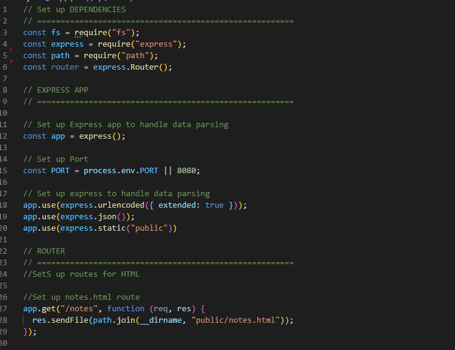

# Note Taking App

## Description
    
I wanted to build an app that a user could use to write and catalog notes. Using a local server the user could write and save notes to themselves then easily call them back. When a user wanted they could also delete a note.

## Table of Contents
1. [Installation](#installation)
1. [Usage](#usage)
1. [Tests](#tests)
1. [Questions](#questions)

## installation
    
this application requires Inquirer as well as express. When you clone this repo run NPM install to get all the data packages you need to get this app up and running. Or check out the deployed site on HEROKU (https://note-taker-morgansean.herokuapp.com/notes) to try it for yourself.
    
## Usage
    
clone repo and run it on your machine or go to deployed app at https://note-taker-morgansean.herokuapp.com/notes and try it out. Log notes and recall them or delete when doen.
        
## Tests
    
[test Video](https://drive.google.com/file/d/1EMzlvx51slU52G9K-nZYHueFslYc_wwn/view)
    
## Questions

Github: insideseanshead
email: insideseanshead@gmail.com
